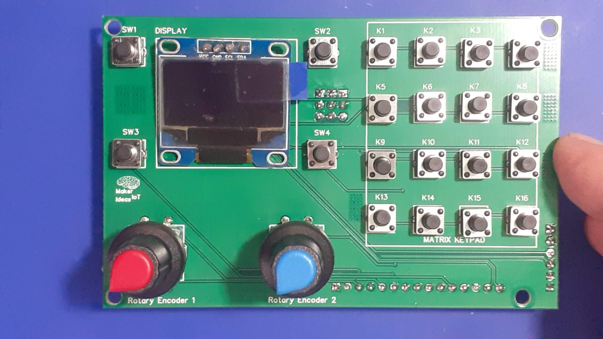

# Home controller

Ideas for a control panel for home automation. Inspired by

## Brainstorming parts needed

## Inspiration from others

#### IO Panel

https://forum.makerforums.info/t/a-simple-io-panel-with-keypad-buttons-encoders-and-a-display-that-i-made-to-make-life-easier-during-project-design-and-testing/88024

#### Button+

https://button.plus/

